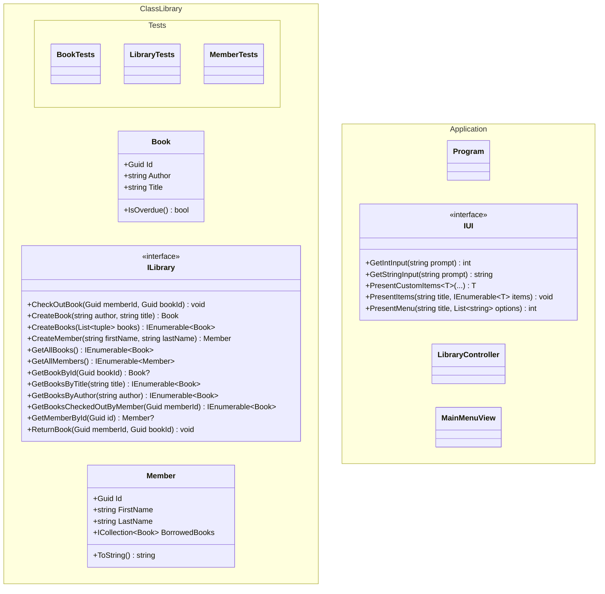

# Solution Structure

This document provides a possible project structure for the MVC application.

## Diagram

The following diagram categorizes different classes into separate projects: a class library, a test project (for the class library), and an application project.



## Folder Strcuture

The following is one possible way the folders and files could be organized, with a solution file at the root level, `doc`, `src`, and `test` folders, and then the separate projects within those folders. Each project is in its own folder and has its own projcet file. Arrows (`->`) indicate project references.

```text
doc\
    Design.md
src\
    mvc_console_app\
        mvc_console_app.csproj
            -> mvc_library
        Program.cs
        Controllers
            LibraryController.cs
        UIs\
            ConsoleUi.cs
        Views\
            MainMenuView.cs
            SearchView.cs
    mvc_library\
        mvc_library.csproj
        Interfaces\
            ILibrary.cs
        Models\
            Book.cs
            Member.cs
test\
    mvc_library.Tests\
        mvc_library.Tests.csproj
            -> mvc_library
        Models\
            BookTests.cs
            MemberTests.cs
mvc.sln
    -> mvc_console_app
    -> mvc_library
    -> mvc_library.Tests
```
